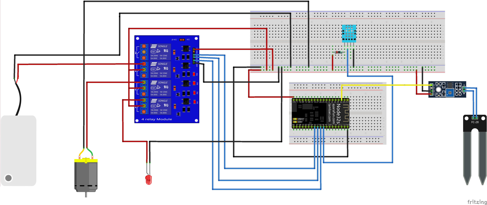

# Green House Conditions COntroller

This system has the ability to moitor users green house farm and be able to control those conditions according to set condition. The system is connected to a firebase which give it the ability to set users required conditons online.

The system also has an offline mode if their no internet connection

## Firebase link
https://firebase.google.com

To use firebase you need to install a library

## library used

DHT.h
WiFI.h
FirebaseESP32.h

## Board Manager Library
If you don't have the ESP32 and ESP8266 board manager, in menu bar select files, from the choices select preference and add the link below to Additional Boards Manager URLs
https://raw.githubusercontent.com/espressif/arduino-esp32/gh-pages/package_esp32_index.json
http://arduino.esp8266.com/stable/package_esp8266com_index.json

## System board sketch diagram

